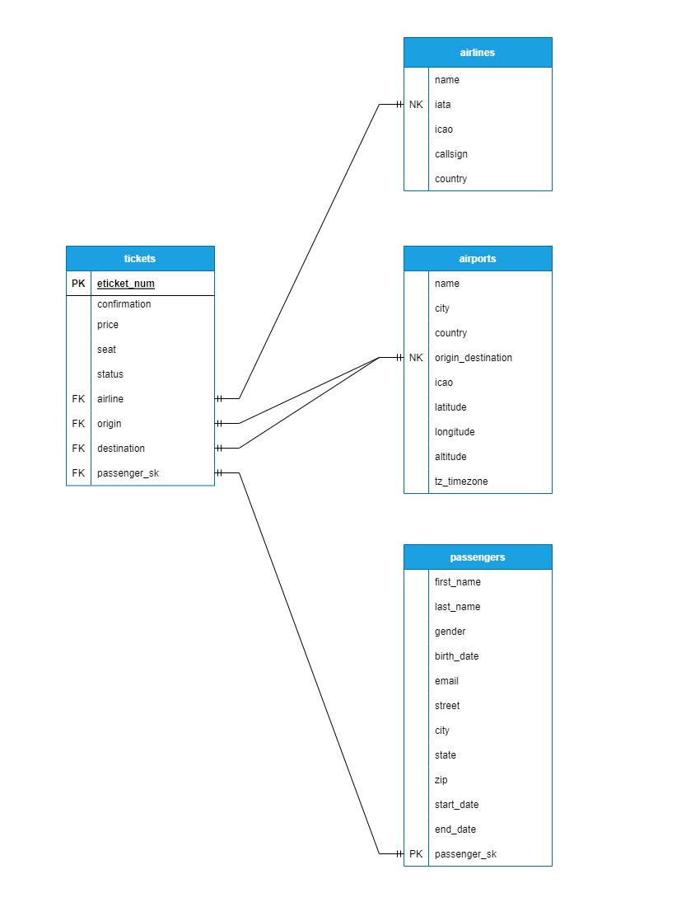

# Data Modeling

### By Philip Kendall

#### This project create an ETL pipeline that extracts data from a JSON file and creates numerous data models with it.
## Technologies Used

* GIT
* Python 3.7
* BigQuery Python client library
* Google SQL
* Jupyter Notebooks

## Description

This project takes data from JSON file that contains information about airplane tickets, and an ETL pipeline is used to create 4 different tables with it. There are 3 dimension tables, airlines, airports, and passengers, and 1 fact table, tickets. The data model below shows how all these tables are connected.

## Setup/Installation Requirements

* Fork over the the repository to your own Github account.
* Clone your Github repo down to your local machine and into the directory you would like this project to be stored.
* Navigate to the main.ipynb file and open it in your text editor.
* Install the requirements.txt file
* After that, the project should be able to run.

## Known Bugs

There are errors when attempting to load the passengers and tickets table to BigQuery resulting from data type errors from the uuid and dated columns.

## License

Permission is hereby granted, free of charge, to any person obtaining
a copy of this software and associated documentation files (the
"Software"), to deal in the Software without restriction, including
without limitation the rights to use, copy, modify, merge, publish,
distribute, sublicense, and/or sell copies of the Software, and to
permit persons to whom the Software is furnished to do so, subject to
the following conditions:

The below copyright notice and this permission notice shall be
included in all copies or substantial portions of the Software.

THE SOFTWARE IS PROVIDED "AS IS", WITHOUT WARRANTY OF ANY KIND,
EXPRESS OR IMPLIED, INCLUDING BUT NOT LIMITED TO THE WARRANTIES OF
MERCHANTABILITY, FITNESS FOR A PARTICULAR PURPOSE AND
NONINFRINGEMENT. IN NO EVENT SHALL THE AUTHORS OR COPYRIGHT HOLDERS BE
LIABLE FOR ANY CLAIM, DAMAGES OR OTHER LIABILITY, WHETHER IN AN ACTION
OF CONTRACT, TORT OR OTHERWISE, ARISING FROM, OUT OF OR IN CONNECTION
WITH THE SOFTWARE OR THE USE OR OTHER DEALINGS IN THE SOFTWARE.

Copyright (c) 2023 Philip Kendall